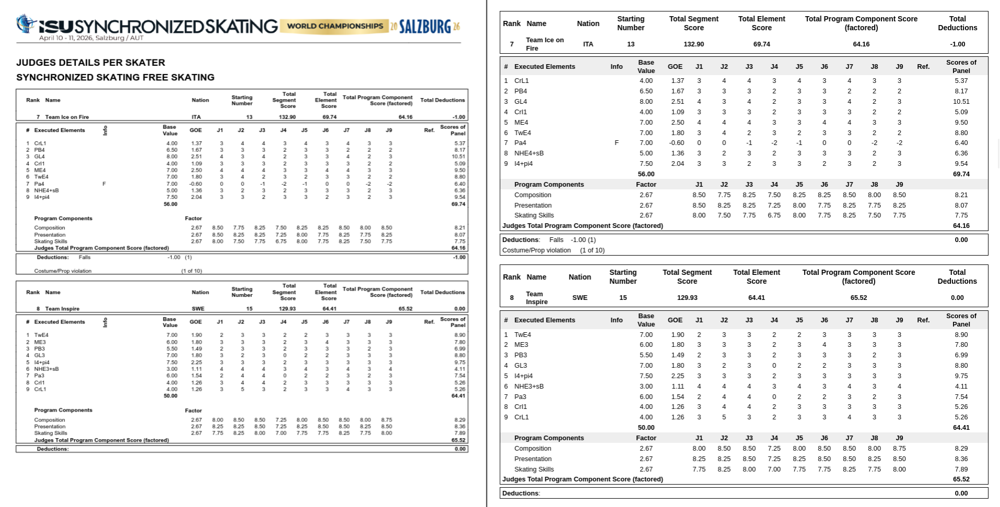

# isu-score-parser

**isu-score-parser** is a versatile tool designed to extract and structure figure skating data, including results, metadata, and technical protocols. 

While it is optimized for **Synchronized Skating**, it supports most artistic disciplines. The project is built into two independent modules, allowing you to use only what you need.

> [!NOTE]
> Maintenance is primarily focused on Synchronized Skating. While other disciplines are generally supported, full compatibility is not guaranteed if their PDF or page structures deviate significantly from the tested standards.


To see examples of outputs you can check the test-outputs folder in the test branch.

To install all the dependencies : 
```sh
pip install requests lxml pandas beautifulsoup4 regex "camelot-py[base]" pdfplumber pyyaml
```

##  Event Data Scraper
Extracts locations, results, and panel data from ISU event pages.

### Features
- **Retro-compatible**: Supports both [modern](https://www.isuresults.com/results/season1819/wcsys2019/index.htm) and [legacy](https://www.figureskatingresults.fi/results/1112/MLSM12/index.htm) competition page layouts.
- **Wayback Machine Integration**: Automatically explores archived pages and their relative links using the archive.org API.
- **Robust Parsing**: Handles various statuses (Ranked, Withdrawn, Did Not Reach Final).

### Installation

```sh
pip install requests lxml pandas beautifulsoup4 regex
```

### Usage

**1. Scrape an event page**

Extract metadata and results. You can also trigger the PDF download immediately with the `-d` flag.
```sh
python3 main.py event scrape <url> [OPTIONS]
```

| Option | Description |
|--|--|
| `-d, --download-pdf` | Dowload the scores PDF found during the scrapping |
|  `-o, --output-dir` | Output directory. Created if it doesn't exist. If not specified, a generic directory will be created. |

**2. Download PDFs from a JSON output**

If you already have a JSON result from a previous scrape, use this to fetch the PDF files.
```sh
python3 main.py event dl <FILE.json> [OPTIONS]
```
| Option | Description |
|--|--|
|  `-o, --output-dir` | Output directory name. If it doesn't exist it will be created. Defaults to the same directory as the JSON file.|

**3. Scrape, download the PDFs and extract their scores**
> [!WARNING]
> requires the dependencies of the next section.

```sh
python3 main.py event fullpipeline <url>
```

**Examples**
```sh
python3 main.py event dl example.json -o Directory
```

```sh
python3 main.py event scrape https://example.com -o Directory
```


## Extract PDFs scores

A tool to extract score tables from synchro skating score PDFs using python.
The extracted tables of scores are stored into json files, and can be completed by adding a yaml file to the parser. 
The parser also support other artistic disciplines.

**Features**:

- **Retrocompatible** : supports ISU score PDFs imported up to 2005
- **Multi-Discipline Architecture**: Engineered to handle various skating disciplines.
  - *Advanced Scoring Support*: Automatic detection of base value bonuses.
- **Granular Data Extraction**:

   - *Deduction analysis* : Captures deduction votes and panel breakdowns.

   - *No-Call Handling*: Properly identifies and processes "No-Call" elements.
- **Built-in Visualizer**: Includes a side-by-side web interface for instant verification of extracted data against the source PDF.


### Installation

Requires :

- Python 3.10+
- Python dependencies :

  - pandas (2.3.3)
  - camelot-py (1.0.9)
  - pdfplumber (0.11.9)
  - PyYaml (6.0.3) (*optional : download if you intend using YAML file to complete your output*)
  - Flask (*to verify your output with your pdf* )

```sh
pip install pandas "camelot-py[base]" pdfplumber pyyaml flask
```

### Usage

**1. Manually**

Use the following options to parse your pdf:

 | Options | Required | Descriptions |
 | --- | --- | --- |
 | `-p`, `--pdf` | yes | PDF file path |
 | `-y`, `--yaml` | no | YAML file path to complete the competition info |
 | `-b`, `--begin` | yes | First page to parse |
 | `-e`, `--end` | no | Last page to parse. If not specified only the first page entered will be parsed |
 | `-o`, `--output` | no | Output directory. If it doesnt exists it will be created, if not specified a generical output directory will be created to put the jsons generated. |

Usage :

```sh
python3 main.py pdf manual [OPTIONS]
```

#### Add info to the jsons generated

With the a YAML file following this pattern:

```yaml
schema_version: 1
competition:
  name: ISU World Synchronized Skating Championships
  location:
    country: SWE
    city: Stockholm
  date: 2018-04-06
season: 2017-2018
source_url: example.org
```

None of the entries (except `shema_version`) or required when parsing. You can remove some of them if data is missing.

**2. Automatic extraction**

Is meant to be a continuation if you have downloaded the event JSON and downloaded the PDFs, but can also work with only pdfs you have downloaded, The only difference is you won't have the name of the event in the folder.

The folders containing all the extracted JSONs scores will be stored in the folder with the PDFs you want to extract.

```sh
python3 main.py pdf auto Folder
```

**3. Visually verify your extracted data with the pdf**

Compare extracted data against the original PDF using a side-by-side web interface.
 | Options | Required | Descriptions |
 | --- | --- | --- |
 | `-p`, `--pdf` | Yes | Path to the source PDF file |
 | `-d`,`--data` | Yes  | Path to the folder containing the extracted JSON scores |
 | `--port` | No | Port for the local server (Defaults to 5000) |

```sh
python3 main.py pdf verify --pdf <path_to_pdf> --data <path_to_json_folderr> 
``` 
*Once started, open your browser at http://127.0.0.1:5000. Press Ctrl+C in the terminal to stop the server.*

#### Preview of the server
*On the left* : the PDF  
*On the right* : the extracted data.



## Futur Objectives
